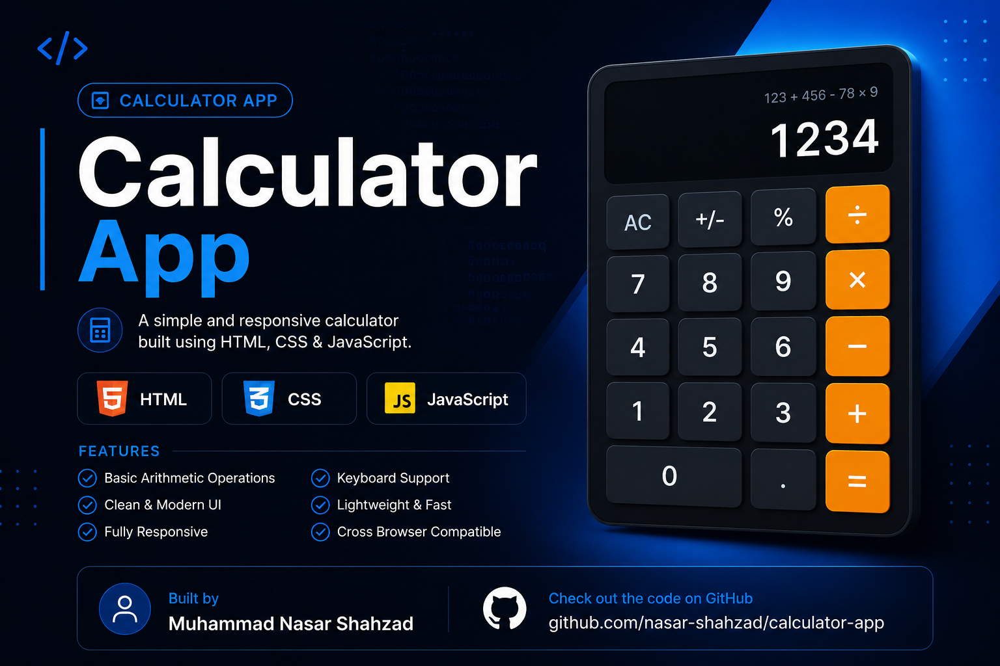

# Simple Calculator App

This is a basic calculator project built using HTML, CSS, and JavaScript.

## Features
- Basic arithmetic operations (+, -, *, /)
- Clear button (C)
- Simple and clean UI

## Technologies Used
- HTML
- CSS
- JavaScript

## Purpose
This project was created for learning DOM manipulation and JavaScript logic.
